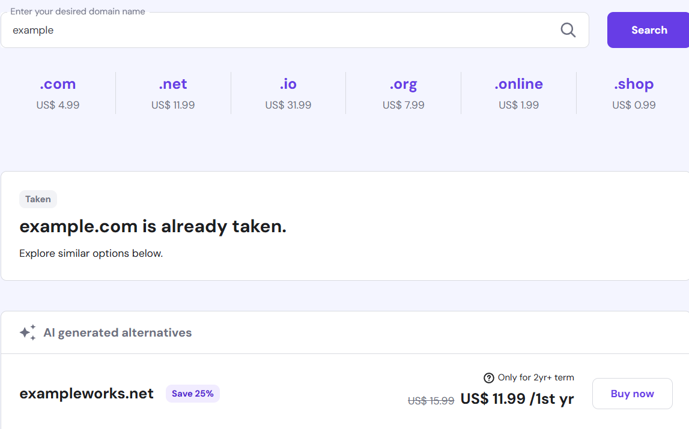
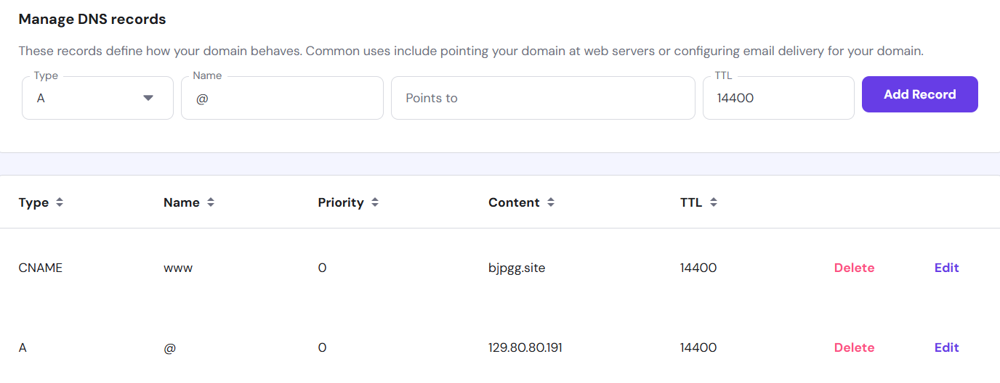
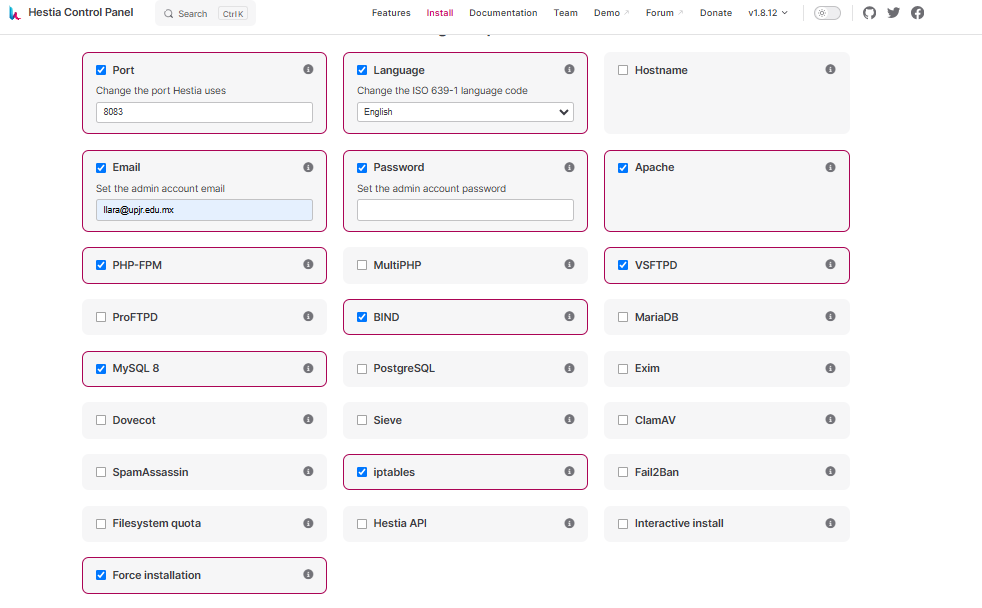
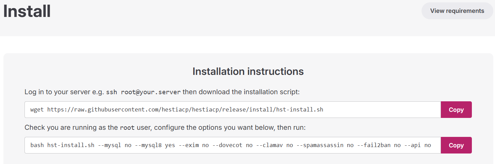
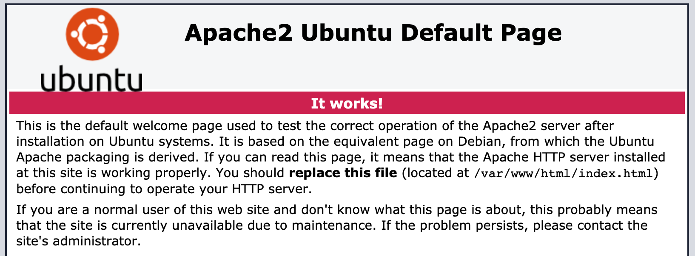
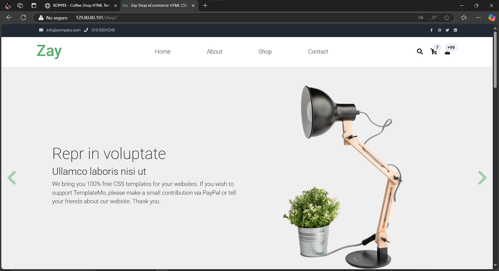
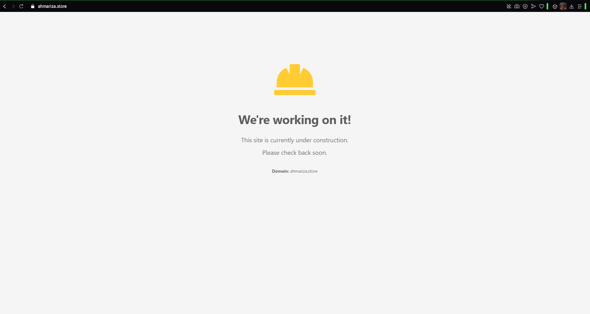

# 🚀 Configuración del servidor, adaptación del entorno y uso de herramientas para la VPS

---

## 🗄️ Bases de Datos y Configuración en Servidores

### 🌍 Configuración de un Dominio en Hostinger  

Para utilizar un **dominio personalizado** en Hostinger y asignarlo a **Hestia Control Panel**, sigue los siguientes pasos:  

#### 📌 1️⃣ Comprar y Configurar el Dominio  
1. Inicia sesión en [Hostinger](https://www.hostinger.com/).  
2. Dirígete a la sección **Dominios** y selecciona **Registrar un nuevo dominio**.  
3. Escribe el nombre del dominio deseado (ejemplo: `midominio.com`) o el nombre que llegase a estar libre para el uso en el cual depende mayormente por la terminación.  



4. Finaliza el proceso de pago y activación del dominio (esto tardará aproximadamente un día en darse).  

---

####  2️⃣ Configurar los Servidores de Nombres (DNS)  
1. En el **Panel de Control** de Hostinger, ve a **Dominios** → **Administrar**.  
2. En la sección de **Nameservers (DNS)**, selecciona la opción **Usar servidores de nombres personalizados**.  

[Configuración para el servidor de Hostinger](https://www.youtube.com/playlist?list=PL-aSvPEYgSGij1bg9HvlLZAJahMNGunX7)

3. Configura los servidores DNS que apunten a tu servidor en Oracle Cloud.  
   - Ejemplo:  
     ```
     ns1.midominio.com
     ns2.midominio.com
     ```  
4. Guarda los cambios y espera la propagación del DNS (puede tardar algunas horas).  



Esta es toda la configuración que se realizará en el DNS proporcionado por Hostinger.

---

### ⚙️ 3️⃣ Asignar el Dominio en Hestia Control Panel  
Para reemplazar `localhost` con tu dominio en Hestia, sigue estos pasos:  

1. Accede a tu servidor vía **SSH** como `root`:  
   ```sh
   ssh root@<IP_DE_TU_SERVIDOR>
   ```

---

## 📌 Hestia Control Panel (VPS)

En **Hestia**, debemos dar clic en los siguientes campos necesarios para el levantamiento del entorno de nuestra página.  

  

Una vez configurados los campos anteriores, se nos proporcionará un **comando SSH** que debemos ejecutar en nuestra instancia de **Oracle Cloud** que tengamos creada, este comando se ejecutará con permisos de `root` para instalar Hestia. 



### 🔗 Instalación de Hestia  
Para instalar Hestia en tu instancia o servidor, se tiene que copiar el **SSH** que nos brinda el mismo Hestia en nuestra terminal que tenga acceso a la terminal de la instancia de **Oracle Cloud**:  

👉 [Panel de instalación de Hestia](https://hestiacp.com/install.html)  

Para configurar tu nombre de dominio (`example.tech`) en **Hestia**, ejecuta los siguientes comandos como `root`, estos nos los proporciona Hestia al momento de colocar las opciones necesarias:

    cd /usr/local/hestia/bin/
    v-change-sys-hostname example.tech
    v-add-letsencrypt-host

---

### 📌 DNS Propagator Checker  

Para verificar que nuestro dominio se haya propagado correctamente y asegurarnos de su correcto funcionamiento, utilizaremos la herramienta **DNS Propagator**.  

Esta herramienta nos permite comprobar si los registros DNS han sido actualizados en diferentes servidores alrededor del mundo.  

#### 🔍 ¿Cómo utilizar DNS Propagator?  
1. Accede a la herramienta en el siguiente enlace:  
   -  [Herramienta para verificar la propagación de DNS](https://www.whatsmydns.net)  
2. Introduce el **nombre de tu dominio** (ejemplo: `midominio.com`).  
3. Selecciona el tipo de registro DNS que deseas verificar (ejemplo: `A`, `CNAME`, `MX`).  
4. Haz clic en el botón **Search** para comprobar la propagación en distintos servidores.  

---

### ✅ Resultados  
- **Marca verde o IP visible**: La propagación ha sido exitosa en ese servidor.  
- **Marca roja o sin datos**: La propagación aún no se ha completado en esa ubicación.  

---

## ⚙️ Instalación de Apache y PHP en Oracle Cloud  

Para instalar un servidor web con **Apache** y **PHP** en una instancia de **Oracle Cloud**, sigue los siguientes pasos.  
  
📖 **Referencia Oficial:** [Oracle Docs](https://docs.oracle.com/en-us/iaas/developer-tutorials/tutorials/apache-on-ubuntu/01oci-ubuntu-apache-summary.htm#set-up-apache-php)  

---

### 🔹 Acceder a la Instancia  

1. Accede a [Oracle Cloud Console](https://cloud.oracle.com/) y ve a **Compute** > **Instances**.  
2. Selecciona la instancia que creaste anteriormente.  
3. En **Instance Details**, localiza la dirección **Public IP Address** y anótala.  

---

### 🔹 Conectar a la Instancia por SSH  

Abre una terminal y navega hasta el directorio donde almacenaste tu clave privada SSH. Luego, ejecuta:  

    ssh -i <tu-clave-privada.pem> ubuntu@<IP_DE_TU_INSTANCIA>  

1. En la instancia entra por medio de la terminal para ejecutar los siguientes comandos de SSH y poder instalar Apache y PHP.

2. Instalación de Apache  
Ejecuta los siguientes comandos para actualizar el sistema e instalar Apache:

        sudo apt update
        sudo apt -y install apache2

3. Iniciar y Verificar Apache  
Inicia Apache y verifica que esté corriendo correctamente:

---

### Configurar el Firewall para Permitir Tráfico HTTP  
Ejecuta los siguientes comandos para actualizar las reglas del firewall y permitir tráfico web en el puerto 80:

    sudo iptables -I INPUT 6 -m state --state NEW -p tcp --dport 80 -j ACCEPT
    sudo netfilter-persistent save

Para checar que la instalación de Apache se ha hecho de manera correcta, coloca la dirección de tu página más la extensión `.index` como prueba. Si se hizo la instalación correctamente, aparecerá el siguiente contenido en pantalla.



___
#### Ejercicios de PHP

Para ver que nuestra página funciona correctamente, coloca dos índices diferentes en la carpeta `/var/www/html/`, esto para ver que nuestro servidor esté trabajando de manera correcta.

- Index de koffe  


- Index de shop  


---

### HTTP a HTTPS - Mayor Seguridad
---

#### ✅ Requisitos Previos
- Un dominio registrado (Ejemplo: midominio.com).
- Un VPS con HestiaCP ya instalado.
- Acceso a la terminal SSH como root.
- El dominio apuntando al servidor mediante DNS.

##### Pasos para Configurar HTTPS en HestiaCP

##### 1️⃣ Acceder a HestiaCP  
Ve a https://<"IP">:8083/ e inicia sesión como admin.

##### 2️⃣ Agregar un Dominio a HestiaCP  
1. En el panel de control, ve a **Web** > **Añadir dominio**.  
2. Escribe tu dominio (Ejemplo: midominio.com).  
3. Marca la opción **Habilitar Soporte SSL**.  
4. Marca la opción **Usar Let’s Encrypt**.  
5. Haz clic en **Guardar**.

##### 3️⃣ Configurar el Certificado SSL Manualmente (Opcional)  
Si la opción Let’s Encrypt no funciona automáticamente, puedes activarlo por SSH con los siguientes comandos:

    v-add-web-domain-ssl "usuario de hestia" midominio.com
    v-add-letsencrypt-domain "usuario de hestia" midominio.com

##### Comprobante de página usando HTTPS



----

## 👨‍💻 Autor

**[Abraham Isai Lara Ariza](https://github.com/ahmAriza01)**  
📧 *323030060@upjr.edu.mx*  
📅 *Última actualización: 30 de marzo de 2025*
