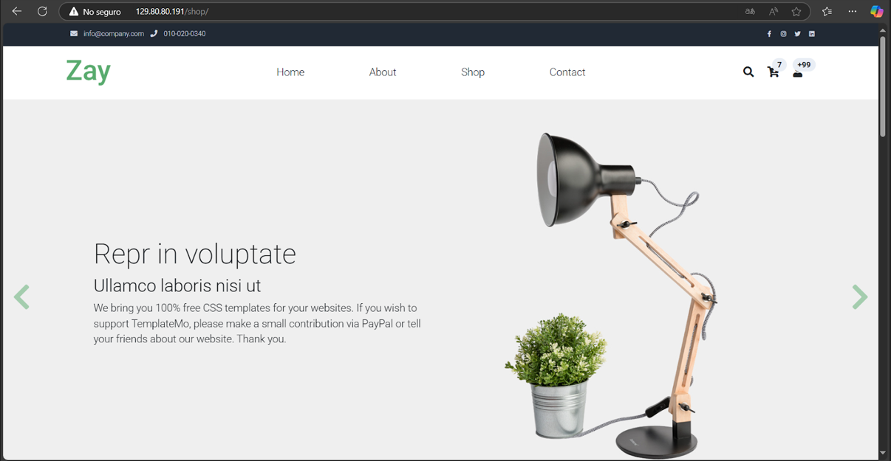

# 🚀 Configuración del servidor, adaptacion del entorno y uso de herramientas para la VPS


---

## 🗄️ Bases de Datos y Configuración en Servidores

### 🌍 Configuración de un Dominio en Hostinger  

Para utilizar un **dominio personalizado** en Hostinger y asignarlo a **Hestia Control Panel**, sigue los siguientes pasos:  

#### 📌 1️⃣ Comprar y Configurar el Dominio  
1. Inicia sesión en [Hostinger](https://www.hostinger.com/).  
2. Dirígete a la sección **Dominios** y selecciona **Registrar un nuevo dominio**.  
3. Escribe el nombre del dominio deseado (ejemplo: `midominio.com`) o el nombre que llegase a estar libre para el uso en el cual depende mayormente por la terminacion.  


4. Finaliza el proceso de pago y activación del dominio (esta tardara aproximadamente un dia en darse).  

---

####  2️⃣ Configurar los Servidores de Nombres (DNS)  
1. En el **Panel de Control** de Hostinger, ve a **Dominios** → **Administrar**.  
2. En la sección de **Nameservers (DNS)**, selecciona la opción **Usar servidores de nombres personalizados**.  

[Configuracion para el serivodor de Hostinger](https://www.youtube.com/playlist?list=PL-aSvPEYgSGij1bg9HvlLZAJahMNGunX7)

3. Configura los servidores DNS que apunten a tu servidor en Oracle Cloud.  
   - Ejemplo:  
     ```
     ns1.midominio.com
     ns2.midominio.com
     ```  
4. Guarda los cambios y espera la propagación del DNS (puede tardar algunas horas).  


Esta es toda la configuracion que se realizara en el DNS proporcionado por hostinger.

---

### ⚙️ 3️⃣ Asignar el Dominio en Hestia Control Panel  
Para reemplazar `localhost` con tu dominio en Hestia, sigue estos pasos:  

1. Accede a tu servidor vía **SSH** como `root`:  
   ```sh
   ssh root@<IP_DE_TU_SERVIDOR>

----

## 📌 Hestia Control Panel (VPS)

En **Hestia**, debemos dar clic en los siguientes campos necesarios para el levantamiento del entorno de nuestra página.  

  

Una vez configurados los campos anteriores, se nos proporcionará un **comando SSH** que debemos ejecutar en nuestra instancia de **Oracle Cloud** que tengamos creada, este comado se ejecutara con permisos de `root` para instalar Hestia. 


### 🔗 Instalación de Hestia  
Para instalar Hestia en tu instancia o serivdor, se tiene que copiar el **SSH** que nos brinda el mismo Hestia en nuestra terminal que tenga acceso a la terminal de la intancia de **Oracle Cloud**  :  

👉 [Panel de instalación de Hestia](https://hestiacp.com/install.html)  


Para configurar tu nombre de dominio (`example.tech`) en **Hestia**, ejecuta los siguientes comandos como `root` estos nos lo proporciona estiea al momento de colocar las opciones necesarias:
   

    cd /usr/local/hestia/bin/
    v-change-sys-hostname example.tech
    v-add-letsencrypt-host
    
----
### 📌 DNS Propagator Checker  

Para verificar que nuestro dominio se haya propagado correctamente y asegurarnos de su correcto funcionamiento, utilizaremos la herramienta **DNS Propagator**.  

Esta herramienta nos permite comprobar si los registros DNS han sido actualizados en diferentes servidores alrededor del mundo.  

#### 🔍 ¿Cómo utilizar DNS Propagator?  
1. Accede a la herramienta en el siguiente enlace:  
   -  [Herramienta para verificar la propagación de DNS](https://www.whatsmydns.net)  
2. Introduce el **nombre de tu dominio** (ejemplo: `midominio.com`).  
3. Selecciona el tipo de registro DNS que deseas verificar (ejemplo: `A`, `CNAME`, `MX`).  
4. Haz clic en el botón **Search** para comprobar la propagación en distintos servidores.  

---

### ✅  Resultados  
- **Marca verde o IP visible**: La propagación ha sido exitosa en ese servidor.  
- **Marca roja o sin datos**: La propagación aún no se ha completado en esa ubicación.  
 

---

## ⚙️ Instalación de Apache y PHP en Oracle Cloud  

Para instalar un servidor web con **Apache** y **PHP** en una instancia de **Oracle Cloud**, sigue los siguientes pasos.  
  
📖 **Referencia Oficial:** [Oracle Docs](https://docs.oracle.com/en-us/iaas/developer-tutorials/tutorials/apache-on-ubuntu/01oci-ubuntu-apache-summary.htm#set-up-apache-php)  

---

### 🔹 Acceder a la Instancia  

1. Accede a [Oracle Cloud Console](https://cloud.oracle.com/) y ve a **Compute** > **Instances**.  
2. Selecciona la instancia que creaste anteriormente.  
3. En **Instance Details**, localiza la dirección **Public IP Address** y anótala.  

---

### 🔹 Conectar a la Instancia por SSH  

Abre una terminal y navega hasta el directorio donde almacenaste tu clave privada SSH. Luego, ejecuta:  


    ssh -i <tu-clave-privada.pem> ubuntu@<IP_DE_TU_INSTANCIA>---

1. En la instancia entra por medio del ka terminal para ejecutar los siguientes comandos de ssh y poder instalar Apache y PHP.

2. Instalación de Apache
Ejecuta los siguientes comandos para actualizar el sistema e instalar Apache:

        sudo apt update
        sudo apt -y install apache2

3. Iniciar y Verificar Apache
Inicia Apache y verifica que esté corriendo correctamente:

----
### Configurar el Firewall para Permitir Tráfico HTTP
Ejecuta los siguientes comandos para actualizar las reglas del firewall y permitir tráfico web en el puerto 80:

    sudo iptables -I INPUT 6 -m state --state NEW -p tcp --dport 80 -j ACCEPT
    sudo netfilter-persistent save

Para checar que la instalacion de Apache se ha echo de manera correcta colocamos la direccion de nuestra pagina mas la extencion de `.index` esto como prueba, si se hizo la instalcion correctmente aparecera el siguinete contenido en pantalla.


___
#### Ejecicios de PHP

Para ver que nuestra pagina funciona correctamente colocamos dos index diferentes en la carpeta ` /var/www/html/`, esto para ver que nuestro servidor este trabajando de manera correcta.

- Index de koffe


- Index de shop



---

### HTTP a HTPPS mayor seguridad
---


##### 💡 Autor: [Juan Pablo Gonzalez Gasca]
##### 📆 Última actualización: [28/Marzo/2025]
