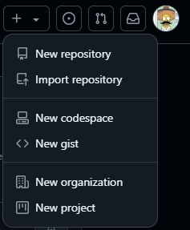
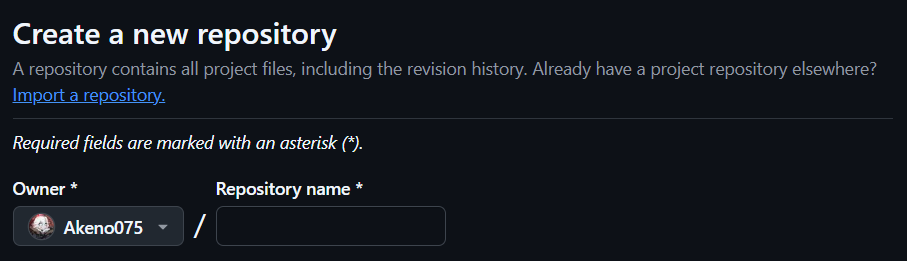
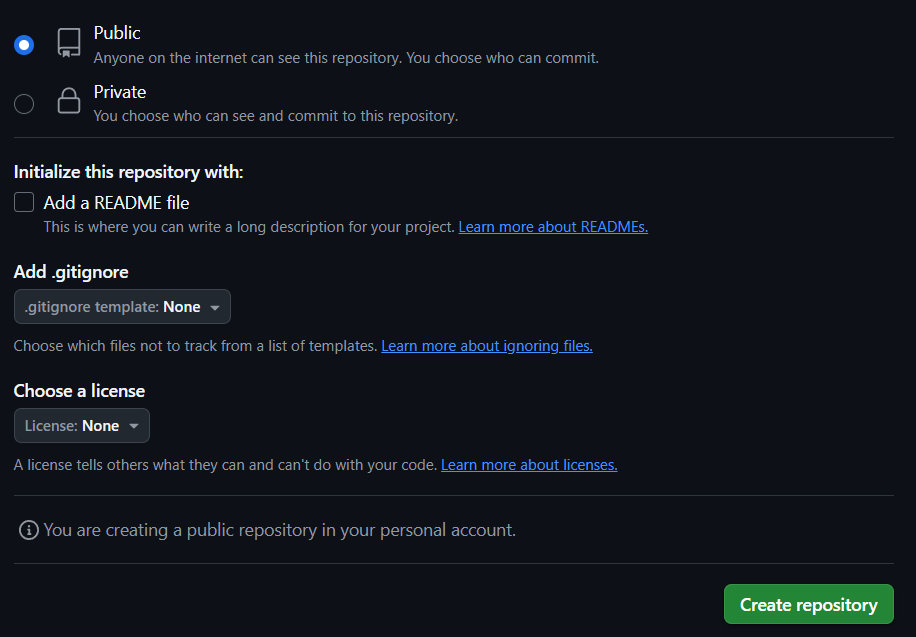

# 🔎 Github
----------------
## Guía para Crear una Cuenta en GitHub y tu Primer Repositorio

### 1. Crear una Cuenta en GitHub

Sigue estos pasos para registrarte en GitHub:

1. **Visita el sitio web**: Ve a [GitHub](https://github.com).
2. **Registrarte**: Haz clic en **"Sign up"** en la parte superior derecha.
3. **Completa la información**: Rellena tu nombre de usuario, correo electrónico y una contraseña segura.
4. **Verificación**: GitHub te pedirá verificar tu cuenta. Realiza el proceso de verificación, ya sea a través de un correo electrónico o captchas.
5. **Selecciona tu plan**: Escoge el plan que prefieras, ya sea gratuito o de pago (el plan gratuito es suficiente para empezar).
6. **Confirmación por correo**: GitHub enviará un correo de confirmación. Haz clic en el enlace para verificar tu dirección de correo electrónico.
7. **Configuración adicional**: Completa las opciones adicionales según prefieras (personalización de tu perfil, intereses, etc.).
8. **Listo**: Ahora ya tienes una cuenta en GitHub.

---

### 2. Crear tu Primer Repositorio

Sigue estos pasos para crear un repositorio en GitHub:

1. **Iniciar sesión**: Inicia sesión con tu cuenta de GitHub.
2. **Crear repositorio**:
   - En la parte superior derecha, haz clic en el icono de tu perfil y selecciona **"Your repositories"**.
   - Haz clic en **"New"** para crear un nuevo repositorio.

   

3. **Configura el repositorio**:
   - **Nombre del repositorio**: Elige un nombre para tu repositorio.
   - **Descripción (opcional)**: Escribe una breve descripción de lo que contiene tu repositorio.
   - **Visibilidad**: Puedes seleccionar entre **"Public"** (público) o **"Private"** (privado).
   - **Inicializar el repositorio**: Puedes seleccionar **"Initialize this repository with a README"** si deseas agregar un archivo README automáticamente.

   

4. **Crear repositorio**: Haz clic en **"Create repository"**.

   

---

### 📁 Desde la Web

1. En la página de tu repositorio, haz clic en **"Add file"** y selecciona **"Upload files"**.
2. Arrastra y suelta los archivos o selecciona los archivos desde tu computadora.
3. Después de subir los archivos, haz clic en **"Commit changes"** para guardarlos.

---

### 💻 Desde la Terminal (usando Git)

1. Abre una terminal en tu computadora.
2. Navega a la carpeta de tu proyecto usando el comando `cd`.
3. Ejecuta estos comandos para subir tus archivos:

   ```bash
   git init
   git remote add origin https://github.com/TuUsuario/TuRepositorio.git
   git add .
   git commit -m "Mi primer commit"

## 👨‍💻 Autor

**[Abraham Isai Lara Ariza](https://github.com/ahmAriza01)**  
📧 *323030060@upjr.edu.mx*  
📅 *Última actualización: 30 de marzo de 2025*

   
   git push -u origin master
