# Oracle Cloud

---

##  Guía para Crear una Cuenta en Oracle Cloud y Desplegar una Instancia

Esta guía te mostrará paso a paso cómo crear una cuenta en Oracle Cloud y desplegar tu primera instancia virtual.

---

##  Registro en Oracle Cloud

1. Accede al sitio oficial: [Oracle Cloud](https://www.oracle.com/cloud/).
2. Haz clic en **"Empieza Gratis"** o selecciona la opción de **registro para estudiantes**.
3. Completa el formulario de inscripción con tus datos personales.
4. Verifica tu correo electrónico y confirma tu cuenta.
5. Ingresa al **Panel de Oracle Cloud** para comenzar a gestionar tus servicios.

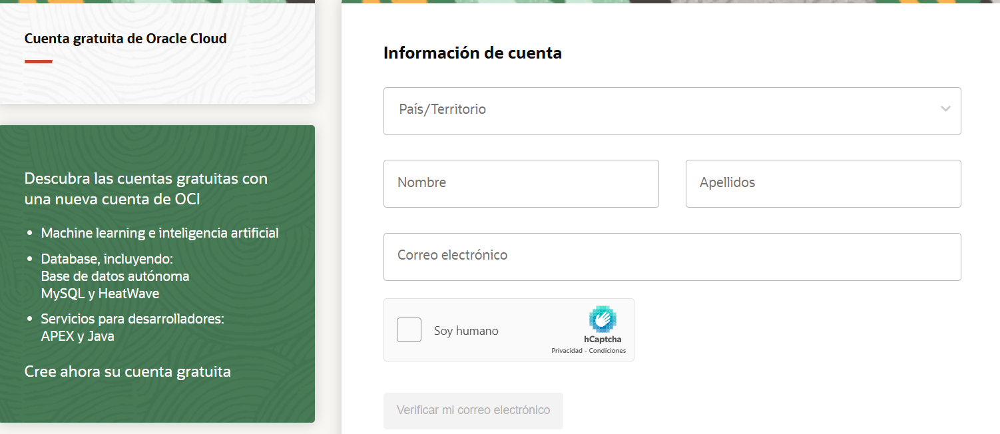

---

##  Creación de una Instancia Virtual

###  Inicio de Sesión

1. Inicia sesión en Oracle Cloud utilizando tu nombre de cliente en la nube (Cloud Account Name).

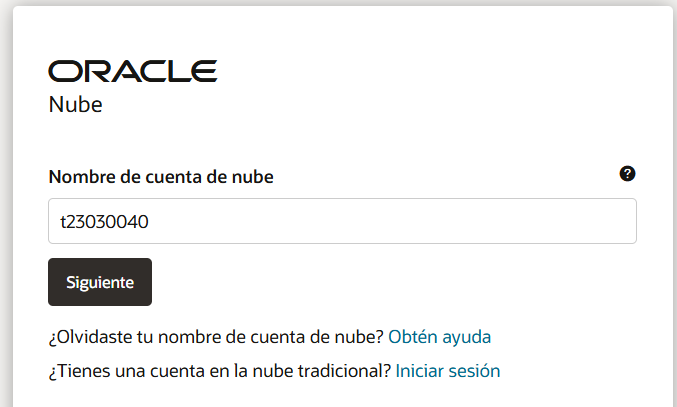

2. Ingresa tus credenciales con las que te registraste previamente.

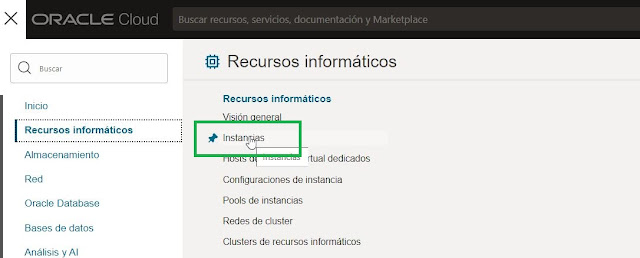

---

##  Paso 1: Iniciar la Creación de la Instancia

1. Desde el menú lateral, navega a **Compute** → **Recursos informáticos**.
2. Selecciona la opción **Instancias**.
3. Haz clic en **Crear instancia**.

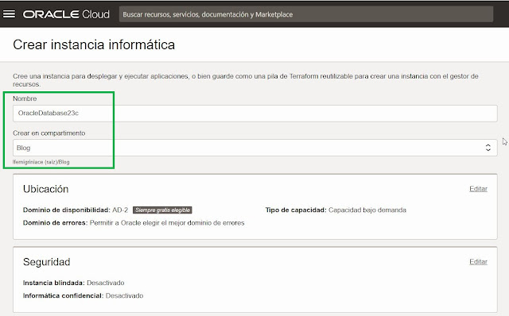 

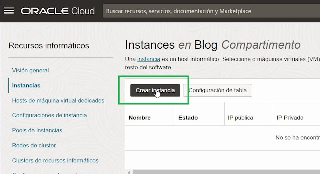

---

##  Paso 2: Configurar la Instancia

- **Nombre de la instancia**: Asigna un nombre identificativo (ej. `mi-servidor`).

  

- **Imagen del sistema operativo (SO)**: Elige una distribución Linux, como `Ubuntu 22.04`.

  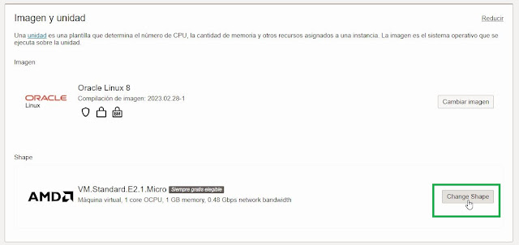

- **Forma de la Máquina Virtual**:
  - Para opciones gratuitas, selecciona **Ampere A1 Compute** o **VM.Standard.E2.1.Micro**.
  - Si requieres más recursos, selecciona una configuración personalizada.

  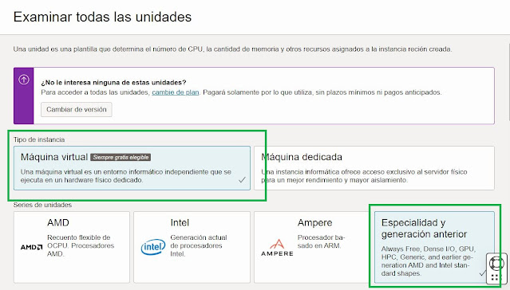

- **Configuración de red**:
  - Si aún no tienes una red configurada, selecciona **Crear nueva red virtual en la nube**.
  - Habilita la opción **Asignar IP pública** para permitir acceso remoto.

  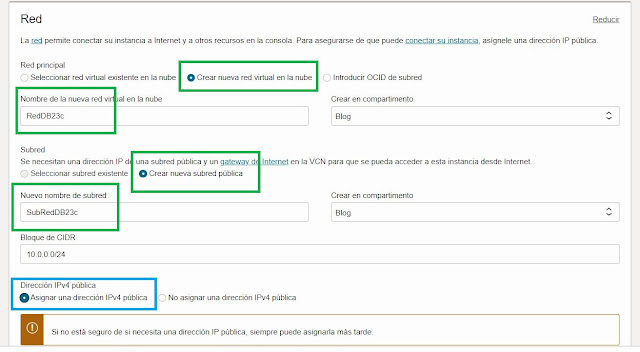

---

##  Paso 3: Configurar Claves SSH

1. Genera un par de claves SSH desde tu terminal:

   ```bash
   ssh-keygen -t rsa -b 4096 -f ~/.ssh/oracle_key


2. Sube la clave pública o utiliza la opción para generarla automáticamente desde Oracle Cloud.
   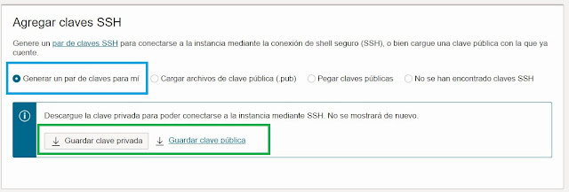

---

##  Confirmar y Crear la Instancia Una vez completada la configuración, haz clic en Crear. El proceso de creación tomará menos de un minuto.
   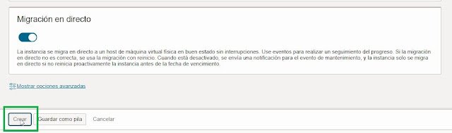
   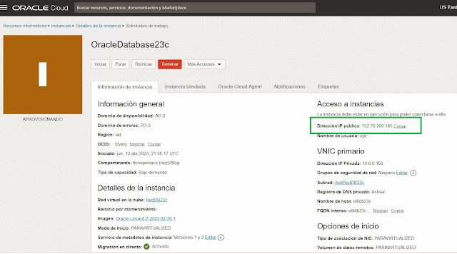

---
##  Configuración Posterior
Una vez creada la instancia, puedes acceder vía SSH desde tu terminal usando la clave generada.
Desde aquí, ya puedes instalar los servicios necesarios como Apache, PHP, entre otros, según el propósito de tu proyecto.

   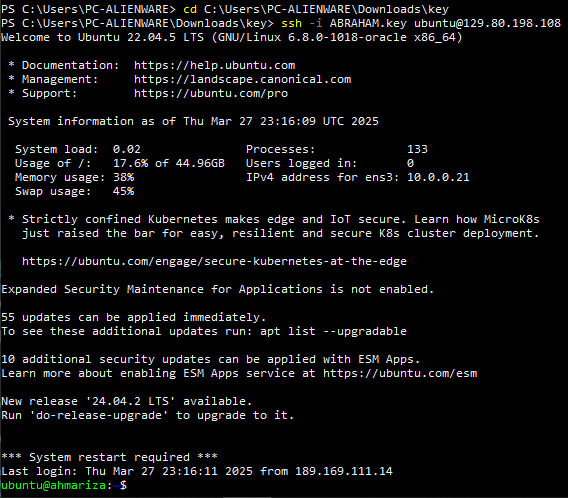

##  Autor

**[Abraham Isai Lara Ariza](https://github.com/ahmAriza01)**  
📧 *323030060@upjr.edu.mx*  
📅 *Última actualización: 30 de marzo de 2025*
